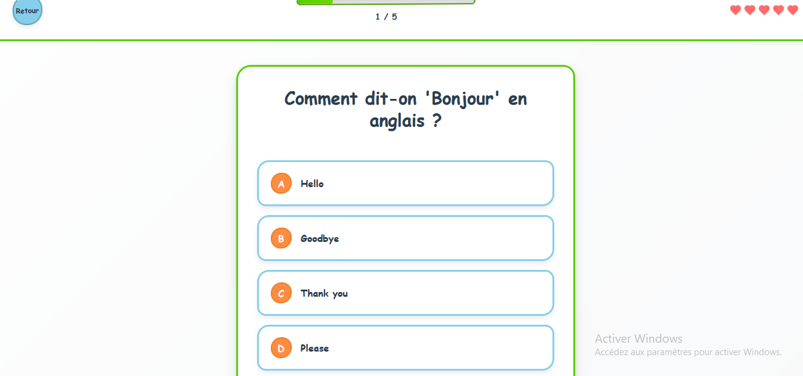
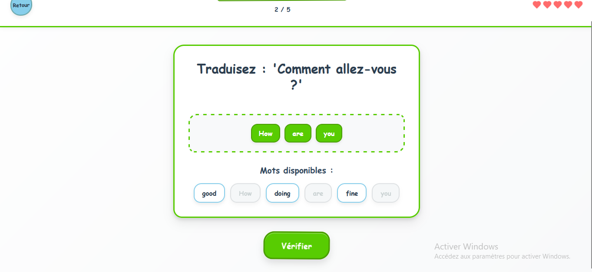
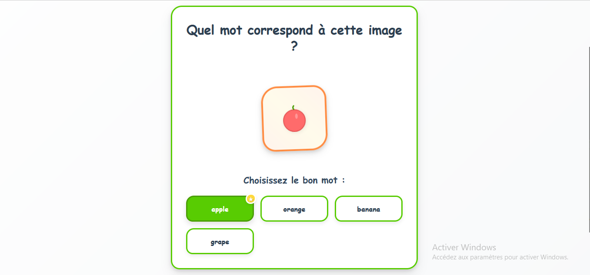

# 🌟 LinguaLeap - Application d'Apprentissage de l'Anglais

> 🚀 **Application moderne d'apprentissage de l'anglais avec 20 leçons progressives, de débutant à expert**

## 📱 Aperçu de l'Application

LinguaLeap est une application interactive d'apprentissage de l'anglais qui propose un parcours complet de 20 leçons, allant des bases aux concepts les plus avancés. Avec une interface moderne et intuitive, elle offre une expérience d'apprentissage engageante et progressive.

## ✨ Fonctionnalités Principales

### 🎯 **Système d'Apprentissage Complet**
- **20 leçons progressives** : Du niveau débutant au niveau expert
- **4 types d'exercices** : Traduction, QCM, Association mot-image, Analyse contextuelle
- **Système de progression XP** : De 100 à 500 points par leçon
- **Système de vies** : 5 cœurs pour maintenir l'engagement
- **Interface responsive** : Compatible desktop, tablette et mobile

### 🧠 **Types d'Exercices Innovants**
- **🔤 Traduction** : Reconstruction de phrases avec mots dispersés intelligemment
- **❓ Questions à Choix Multiples** : QCM avec feedback visuel immédiat
- **🖼️ Association Mot-Image** : Apprentissage visuel avec illustrations SVG
- **🔍 Analyse Contextuelle** : Nouveau ! Compréhension en contexte

### 🎨 **Design & UX**
- **Interface moderne** : Design coloré et engageant inspiré de Duolingo
- **Animations fluides** : Transitions et micro-interactions avec Framer Motion
- **Feedback visuel** : Couleurs et animations pour guider l'apprentissage
- **Mascotte hibou** : Compagnon d'apprentissage animé
- **UX optimisée** : Passage instantané entre questions, sans messages intrusifs

## 📚 Parcours d'Apprentissage (20 Leçons)

### 🌱 **Niveau Débutant (Leçons 1-5)**
1. **Les bases - Salutations** (100 XP)
2. **Les animaux** (120 XP)
3. **Architecture & Espaces de Vie** (140 XP)
4. **Mobilité & Transport Moderne** (160 XP)
5. **Défis Couleurs & Logique** (180 XP)

### 🌿 **Niveau Intermédiaire (Leçons 6-10)**
6. **Mathématiques & Temps en Anglais** (200 XP)
7. **Relations Familiales Complexes** (220 XP)
8. **Gastronomie & Nutrition** (240 XP)
9. **Météorologie & Expressions Temporelles** (260 XP)
10. **🏆 Maîtrise Linguistique** (400 XP)

### 🌳 **Niveau Avancé (Leçons 11-15)**
11. **🎭 Émotions & Psychologie Humaine** (300 XP)
12. **🚀 Innovation & Technologie Future** (320 XP)
13. **🌍 Enjeux Environnementaux Globaux** (340 XP)
14. **🎨 Art, Créativité & Expression** (360 XP)
15. **🧠 Philosophie & Pensée Critique** (400 XP)

### 🏆 **Niveau Expert (Leçons 16-20)**
16. **🌌 Astrophysique & Cosmos** (420 XP)
17. **🧬 Biotechnologie & Génétique Avancée** (440 XP)
18. **🌐 Géopolitique & Relations Internationales** (460 XP)
19. **🧠 Neurosciences & Conscience** (480 XP)
20. **🌟 Maîtrise Suprême - Synthèse Interdisciplinaire** (500 XP)

## 🖼️ Captures d'Écran

### Interface de Leçon

### Types d'Exercices

### Version Mobile

## 🆕 Nouveautés Version 2.0

### ✨ **Nouvelles Fonctionnalités**
- **5 nouvelles leçons expertes** (16-20) avec thèmes avancés
- **Nouveau composant d'exercice** : Analyse Contextuelle
- **UX améliorée** : Suppression des messages de feedback intrusifs
- **Progression instantanée** : Passage immédiat entre les questions
- **Vocabulaire enrichi** : Plus de 200 nouveaux mots et expressions

### 🔧 **Améliorations Techniques**
- **Performance optimisée** : Chargement plus rapide des leçons
- **Code refactorisé** : Architecture plus maintenable
- **Types TypeScript** : Meilleure sécurité de type
- **Responsive design** : Amélioration de l'affichage mobile

## 🛠️ Technologies Utilisées

### **Frontend**
- **React 18.2** - Framework UI moderne
- **TypeScript 5.0** - Typage statique
- **Vite** - Build tool ultra-rapide
- **Framer Motion** - Animations fluides

### **Styling & UI**
- **CSS3 personnalisé** - Design sur mesure
- **SVG intégrés** - Illustrations vectorielles
- **Design responsive** - Mobile-first approach

### **Déploiement**
- **Vercel** - Hébergement et CI/CD
- **GitHub** - Contrôle de version
- **Electron** - Version desktop (optionnelle)

## 🚀 Déploiement

L'application est déployée automatiquement sur Vercel à partir du repository privé `lingualeap-app`.

**🔗 Lien de l'application** : [Accéder à LinguaLeap](https://lingualeap-app.vercel.app)

## 📊 Statistiques du Projet

- **20 leçons complètes** avec progression logique
- **Plus de 160 exercices** variés et engageants
- **4 types d'exercices** différents
- **500+ mots et expressions** enseignés
- **Interface 100% responsive** pour tous les appareils

## 🎯 Public Cible

- **Débutants** : Apprentissage des bases de l'anglais
- **Intermédiaires** : Renforcement et approfondissement
- **Avancés** : Maîtrise de concepts complexes
- **Experts** : Synthèse interdisciplinaire et perfectionnement

## 🤝 Contribution

Ce projet est en développement actif. Pour contribuer :

1. Consultez les issues ouvertes
2. Proposez de nouvelles fonctionnalités
3. Signalez les bugs rencontrés
4. Partagez vos retours d'expérience

## 📄 Licence

Ce projet est sous licence MIT. Voir le fichier [LICENSE](LICENSE) pour plus de détails.

## 👨‍💻 Développeur

**Mohamed Kone** (Mohkone01)
- GitHub: [@Mohkone01](https://github.com/Mohkone01)
- Email: konmohamed149@yahoo.com

---

⭐ **N'hésitez pas à donner une étoile si ce projet vous plaît !**

🚀 **Commencez votre apprentissage dès maintenant** : [LinguaLeap App](https://lingualeap-app.vercel.app)
