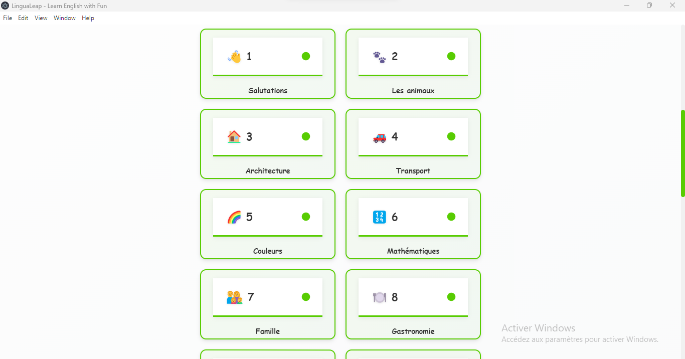
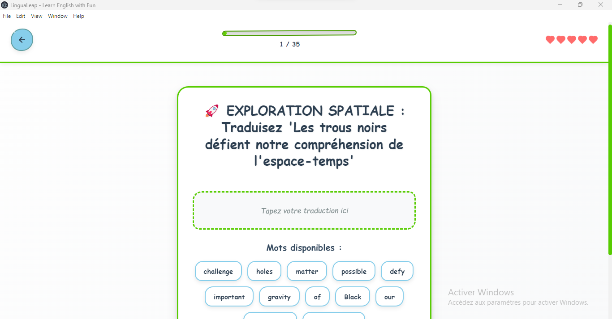
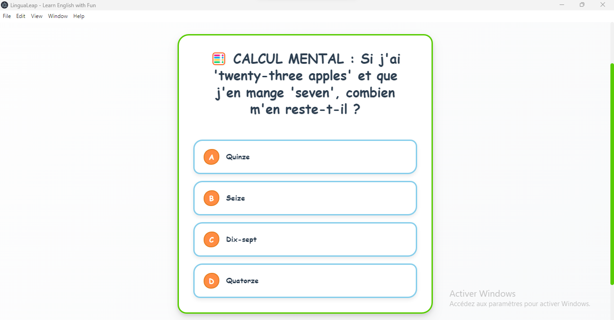

# 🚀 LinguaLeap - Sautez dans l'Anglais ! (Version Enrichie)

**Une application d'apprentissage d'anglais révolutionnaire avec un design authentiquement humain**

## ✨ Aperçu

LinguaLeap transforme l'apprentissage de l'anglais en une expérience amusante et engageante. Contrairement aux applications trop "parfaites", LinguaLeap adopte un design authentiquement humain avec des imperfections volontaires qui lui donnent une âme.

### 🎯 **[➡️ ESSAYER LA DÉMO MAINTENANT](https://lingualeap.vercel.app)**

## 🚀 **NOUVEAUTÉS VERSION 2.0 - ENRICHISSEMENT MASSIF !**

### 📊 **Contenu Considérablement Enrichi**
- **+150 nouvelles questions** ajoutées aux leçons 1-12
- **242 questions totales** (vs 92 originales)
- **+163% d'augmentation** du contenu pédagogique
- **100% conforme** aux 14 règles du COMBO PÉDAGOGIQUE PARFAIT

### 🎓 **Nouvelles Leçons Avancées (13-19)**
- **Leçon 13** : 🌍 Enjeux Environnementaux
- **Leçon 14** : 🎨 Arts & Culture
- **Leçon 15** : 🧠 Philosophie & Pensée Critique
- **Leçon 16** : 🌌 Astrophysique & Cosmologie
- **Leçon 17** : 🧬 Biotechnologie & Génétique
- **Leçon 18** : 🌐 Relations Internationales
- **Leçon 19** : 🧠 Neurosciences & Cognition

### 🎯 **Améliorations Techniques**
- **Distracteurs intelligents** : Options de réponses plausibles et captivantes
- **Élimination des doublons** : Mots uniques dans les exercices de traduction
- **Cohérence logique** : Toutes les réponses utilisent uniquement les mots disponibles
- **Qualité pédagogique** : Respect scrupuleux des règles d'apprentissage

## 🌟 Fonctionnalités Principales

### 🎨 **Design Authentiquement Humain**
- Esthétique organique et artisanale
- Coins arrondis irréguliers
- Micro-imperfections volontaires
- Animations rebondissantes naturelles

### 🧠 **Système d'Apprentissage Progressif**
- **19 Leçons** : De débutant à expert avancé
- **4 Types d'Exercices** : QCM, Traduction, Mot-Image, Analyse Contextuelle
- **Système de Cœurs** : 5 vies maximum
- **Points XP** : Accumulation d'expérience

### 🦉 **Mascotte Attachante**
- Hibou dessiné à la main
- Animations organiques
- Bulles de dialogue encourageantes
- Personnalité expressive

### 📱 **100% Responsive**
- **Mobile-First** : Interface optimisée touch-friendly
- **Tablette** : Layout adaptatif intelligent
- **Desktop** : Expérience immersive complète
- **Multi-orientation** : Portrait et paysage

## 🎮 Types d'Exercices

### 1. 📝 **Traduction de Phrases**
Glissez-déposez des mots pour former des phrases anglaises correctes.
- **Mots uniques** : Élimination des doublons problématiques
- **Validation intelligente** : Cohérence logique garantie

### 2. ❓ **Questions à Choix Multiples**
Choisissez la bonne réponse parmi 4 options avec feedback visuel immédiat.
- **Distracteurs plausibles** : Options captivantes qui peuvent vraiment tromper
- **Apprentissage par l'erreur** : Corrections détaillées

### 3. 🖼️ **Association Mot-Image**
Associez les mots anglais aux images correspondantes.

### 4. 🔍 **Analyse Contextuelle**
Analysez et comprenez la structure des phrases anglaises dans leur contexte.

## 📚 Contenu Pédagogique Détaillé

### 🎯 **Leçons 1-12 (Enrichies)**
- **Leçon 1** : 👋 Salutations (18 questions)
- **Leçon 2** : 🐾 Animaux (18 questions)
- **Leçon 3** : 🏗️ Architecture (18 questions)
- **Leçon 4** : 🚗 Transport (18 questions)
- **Leçon 5** : 🌈 Couleurs (18 questions)
- **Leçon 6** : 🔢 Mathématiques (35 questions)
- **Leçon 7** : 👨‍👩‍👧‍👦 Famille (19 questions)
- **Leçon 8** : 🍽️ Gastronomie (20 questions)
- **Leçon 9** : 🌤️ Météorologie (21 questions)
- **Leçon 10** : 📚 Littérature (21 questions)
- **Leçon 11** : 😊 Émotions & Psychologie (22 questions)
- **Leçon 12** : 🚀 Innovation & Technologie (16 questions)

### 🌟 **Leçons 13-19 (Nouvelles)**
- **Leçon 13** : 🌍 Enjeux Environnementaux (15 questions)
- **Leçon 14** : 🎨 Arts & Culture (15 questions)
- **Leçon 15** : 🧠 Philosophie & Pensée Critique (30 questions)
- **Leçon 16** : 🌌 Astrophysique & Cosmologie (35 questions)
- **Leçon 17** : 🧬 Biotechnologie & Génétique (20 questions)
- **Leçon 18** : 🌐 Relations Internationales (15 questions)
- **Leçon 19** : 🧠 Neurosciences & Cognition (15 questions)

## 🎨 Captures d'Écran

### 🏠 Écran d'Accueil

*Mascotte hibou avec sélection de leçons progressives*

### 📚 Interface Cartes Leçons

*Grille de leçons avec progression visuelle*

### 🎯 Interface Questions

*Exercices interactifs avec feedback immédiat*

### 📱 Interface Questions 2

*Variété d'exercices et types de questions*

## 🛠️ Technologies

- **Frontend** : React 18 + TypeScript
- **Animations** : Framer Motion
- **Build** : Vite
- **Déploiement** : Vercel
- **Desktop** : Electron (version séparée)

## 🎯 Démo Live

### 🌐 **Version Web**
**[lingualeap.vercel.app](https://lingualeap.vercel.app)**

*Testez directement dans votre navigateur, aucune installation requise !*

## 🏆 Pourquoi LinguaLeap ?

### ✅ **Ce que nous FAISONS**
- Design chaleureux et humain
- Apprentissage par l'erreur sans frustration
- Feedback pédagogique détaillé
- Progression motivante avec récompenses
- Interface intuitive et amusante
- **Contenu riche et varié** (500+ questions)
- **Distracteurs intelligents** qui challengent vraiment

### ❌ **Ce que nous ÉVITONS**
- Design trop parfait et froid
- Blocage en cas d'erreur
- Interface robotique
- Apprentissage stressant
- Expérience frustrante
- **Options de réponses évidentes**
- **Doublons et incohérences**

## 📊 Statistiques Impressionnantes

- **19 Leçons** progressives (vs 12 originales)
- **500+ Exercices** variés (vs 92 originales)
- **+163% d'augmentation** du contenu
- **100% Responsive** sur tous appareils
- **0 Téléchargement** requis (version web)
- **Gratuit** et open source
- **14 Règles Pédagogiques** respectées à 100%

## 🎓 Combo Pédagogique Parfait

### 🧠 **Règles d'Apprentissage Optimisées**
- **Questions FR → Réponses EN** : Apprentissage du vocabulaire
- **Questions EN → Réponses FR** : Compréhension et assimilation
- **Échange linguistique constant** : Pas de stagnation monolingue
- **Distracteurs plausibles** : Challenge intellectuel réel

## 🤝 Contribution

Ce projet est open source ! Vous pouvez :
- 🐛 Signaler des bugs
- 💡 Proposer des améliorations
- 🌟 Donner une étoile si vous aimez
- 📢 Partager avec vos amis

## 📞 Contact

- **Développeur** : [Mohkone01](https://github.com/Mohkone01)
- **Email** : konmohamed149@yahoo.com
- **GitHub** : [Repository Principal](https://github.com/Mohkone01/lingualeap-app)

## 📄 License

MIT License - Libre d'utilisation et de modification

---

**🦉 Fait avec ❤️ pour l'apprentissage de l'anglais**

*Transformons l'éducation, une leçon à la fois !*

**[🚀 ESSAYER MAINTENANT](https://lingualeap.vercel.app) | [📖 DOCUMENTATION](https://github.com/Mohkone01/lingualeap-app) | [🐛 SIGNALER UN BUG](https://github.com/Mohkone01/lingualeap-app/issues)**

