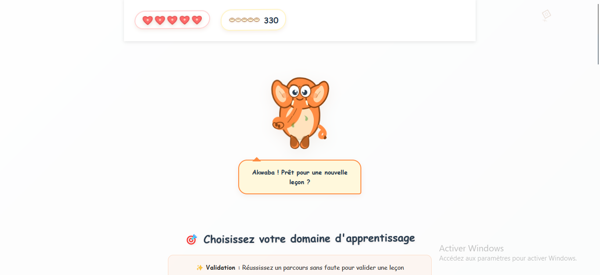
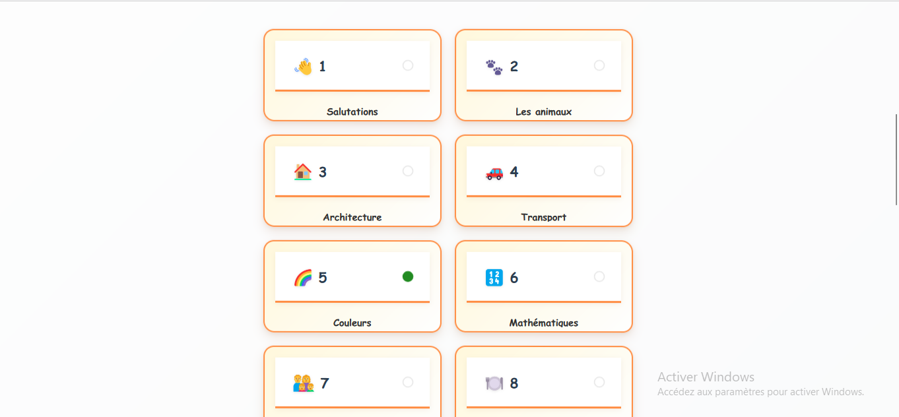
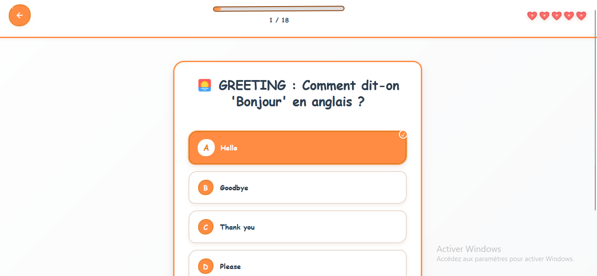
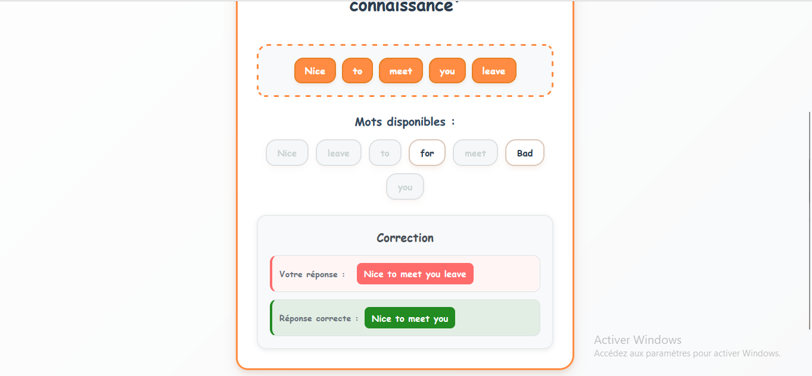

# 🇨🇮 Akwaba English

**Akwaba** signifie "Bienvenue" en langues ivoiriennes

*Application d'apprentissage de l'anglais 100% ivoirienne avec design authentique, mascotte éléphant et pédagogie adaptée*

[🌐 **ESSAYER MAINTENANT**](https://akwaba-english.vercel.app) • • 

---

## 🎯 **Pourquoi Akwaba English ?**

### 🇨🇮 **100% Ivoirien, 100% Authentique**
- **Design culturel** inspiré des motifs Baoulé et couleurs du drapeau
- **Mascotte éléphant** dessinée à la main avec style artisanal
- **Hospitalité ivoirienne** : "Akwaba" = Bienvenue dans votre apprentissage
- **Pédagogie adaptée** aux apprenants francophones d'Afrique de l'Ouest

### 🎓 **Méthode Pédagogique Unique**
- **Combo Pédagogique Parfait** : Questions FR→Réponses EN / Questions EN→Réponses FR
- **22 Leçons Progressives** de salutations aux concepts avancés
- **400+ Exercices Interactifs** avec 4 types d'activités
- **Système de Validation Intelligent** avec corrections détaillées

### 🎮 **Gamification Motivante**
- **Système XP** avec récompenses et niveaux
- **Cœurs de Vie** pour maintenir la motivation
- **20+ Succès à Débloquer** pour célébrer les progrès
- **Statistiques Détaillées** pour suivre l'évolution

---

## 🖼️ **Découvrez l'Interface**

### 🏠 Écran d'Accueil - Design Ivoirien Authentique

*Interface principale avec mascotte éléphant, couleurs du drapeau ivoirien et esthétique artisanale*

### 📚 Sélection des Leçons - Navigation Intuitive

*Grille de leçons avec progression visuelle, design organique et motifs culturels*

### 🎯 Exercices Interactifs - Apprentissage Engageant

*Questions à choix multiples avec design épuré, mascotte encourageante et interface claire*

### ✅ Corrections Intelligentes - Feedback Constructif

*Système de correction avec feedback immédiat, explications détaillées et encouragements*

---

## 🚀 **Essayer Immédiatement**

### 🌐 **Version Web (Recommandée)**
**[👉 LANCER AKWABA ENGLISH](https://akwaba-english.vercel.app)**
- ✅ Aucune installation requise
- ✅ Fonctionne sur tous les navigateurs
- ✅ Responsive mobile et desktop
- ✅ Mise à jour automatique

### 📱 **Installation Mobile (PWA)**
1. Ouvrir [akwaba-english.vercel.app](https://akwaba-english.vercel.app)
2. Cliquer sur "Ajouter à l'écran d'accueil"
3. Utiliser comme une app native !

---

## 🎨 **Design System Ivoirien**

### 🎨 **Palette Authentique**
- **🟠 Orange Ivoirien** : `#ff8c42` - Couleur principale du drapeau
- **⚪ Blanc Pur** : `#fefefe` - Pureté et clarté
- **🟢 Vert Ivoirien** : `#228B22` - Nature et croissance
- **🤎 Terre de Côte d'Ivoire** : `#8B4513` - Authenticité culturelle

### 🎭 **Éléments Visuels**
- **Bordures Organiques** : Coins arrondis irréguliers pour un style artisanal
- **Ombres Douces** : Effets subtils inspirés de la lumière tropicale
- **Animations Fluides** : Mouvements naturels comme la brise ivoirienne
- **Typographie Chaleureuse** : Moderne avec touches d'imperfection charmante

---

## 🏆 **Fonctionnalités Avancées**

### 📖 **Système Pédagogique Intelligent**
- **Adaptation Automatique** : Difficulté qui s'ajuste au niveau
- **Mémorisation Espacée** : Révision optimisée des concepts
- **Analyse des Erreurs** : Identification des points faibles
- **Progression Personnalisée** : Parcours adapté à chaque apprenant

## 🌍 **Impact et Mission**

### 🎯 **Notre Vision**
Démocratiser l'apprentissage de l'anglais en Afrique de l'Ouest avec une approche culturellement adaptée et technologiquement avancée.

### 📈 **Objectifs**
- **Accessibilité** : Gratuit et disponible partout
- **Qualité** : Standards pédagogiques internationaux
- **Culture** : Préservation de l'identité ivoirienne
- **Innovation** : Technologies modernes au service de l'éducation

### 🤝 **Communauté**
- **Open Source** : Code ouvert pour la collaboration
- **Feedback Utilisateurs** : Amélioration continue
- **Partenariats Éducatifs** : Collaboration avec les institutions
- **Expansion Régionale** : Adaptation à d'autres pays africains

---

## 🛠️ **Technologies Utilisées**

### 🎨 **Frontend**
- **React 18** : Interface utilisateur moderne
- **TypeScript** : Code robuste et maintenable
- **Framer Motion** : Animations fluides
- **CSS3** : Design responsive et accessible

### ⚡ **Build et Déploiement**
- **Vite** : Build ultra-rapide
- **Vercel** : Déploiement automatique
- **Electron** : Applications desktop
- **PWA** : Installation mobile

### 🔧 **Outils de Développement**
- **ESLint** : Qualité du code
- **Prettier** : Formatage automatique
- **Git** : Contrôle de version
- **GitHub Actions** : CI/CD automatisé

---

## 🤝 **Contribuer au Projet**

### 🌟 **Comment Aider**
1. **⭐ Star le projet** pour montrer votre soutien
2. **🐛 Signaler des bugs** via les Issues GitHub
3. **💡 Proposer des améliorations** dans les Discussions
4. **🔧 Contribuer au code** avec des Pull Requests
5. **📢 Partager** avec votre réseau

### 👥 **Types de Contributions**
- **Développement** : Nouvelles fonctionnalités, corrections
- **Design** : Améliorations visuelles, UX/UI
- **Contenu** : Nouvelles leçons, exercices, traductions
- **Documentation** : Guides, tutoriels, exemples
- **Tests** : Assurance qualité, feedback utilisateur

### 📋 **Guidelines**
- Respecter le style de code existant
- Tester toutes les modifications
- Documenter les nouvelles fonctionnalités
- Suivre les conventions de commit

---

## 📞 **Support et Contact**

### 🆘 **Besoin d'Aide ?**
- **📚 Documentation** : [Guide Complet](GUIDE_MODIFICATION_COMPLET.md)
- **🐛 Bugs** : [GitHub Issues](https://github.com/votre-username/akwaba-english/issues)
- **💬 Discussions** : [GitHub Discussions](https://github.com/votre-username/akwaba-english/discussions)
- **📧 Email** : konmohamed149@yahoo.com
---

## 📄 **Licence et Crédits**

### 📜 **Licence**
Ce projet est sous licence MIT. Voir [LICENSE](LICENSE) pour plus de détails.

### 🙏 **Remerciements**
- **Communauté Ivoirienne** pour l'inspiration culturelle
- **Artistes Locaux** pour les motifs traditionnels Baoulé
- **Éducateurs** pour les retours pédagogiques précieux
- **Développeurs Open Source** pour les outils fantastiques
- **Beta Testeurs** pour leur feedback constructif

---

## 🇨🇮 **Akwaba dans l'apprentissage de l'anglais !** 🐘

*Fait avec ❤️ en Côte d'Ivoire pour l'Afrique et le monde*

**[🚀 COMMENCER MAINTENANT](https://akwaba-english.vercel.app)**

[⭐ Star](https://github.com/votre-username/akwaba-english) • [🐛 Bug Report](https://github.com/votre-username/akwaba-english/issues) • [💡 Feature Request](https://github.com/votre-username/akwaba-english/discussions) • [📧 Contact](mailto:konmohamed149@yahoo.com)

---

*"L'éducation est l'arme la plus puissante pour changer le monde"* - Nelson Mandela

