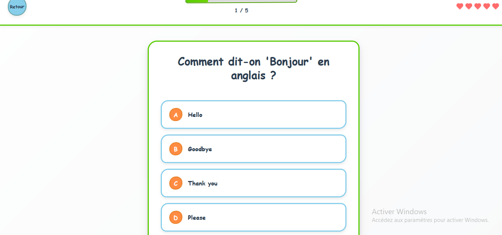

# 🚀 LinguaLeap - Sautez dans l'Anglais !

**Une application d'apprentissage d'anglais révolutionnaire avec un design authentiquement humain**

### 🎯 **[➡️ ESSAYER LA DÉMO MAINTENANT](https://lingualeap.vercel.app)**

## ✨ Aperçu

LinguaLeap transforme l'apprentissage de l'anglais en une expérience amusante et engageante. Contrairement aux applications trop "parfaites", LinguaLeap adopte un design authentiquement humain avec des imperfections volontaires qui lui donnent une âme.

## 🌟 Fonctionnalités Principales

### 🎨 **Design Authentiquement Humain**
- Esthétique organique et artisanale
- Coins arrondis irréguliers
- Micro-imperfections volontaires
- Animations rebondissantes naturelles

### 🧠 **Système d'Apprentissage Progressif**
- **10 Leçons** : De débutant à intermédiaire avancé
- **4 Types d'Exercices** : QCM, Traduction, Mot-Image, Analyse
- **Système de Cœurs** : 5 vies maximum
- **Points XP** : Accumulation d'expérience

### 🦉 **Mascotte Attachante**
- Hibou dessiné à la main
- Animations organiques
- Bulles de dialogue encourageantes
- Personnalité expressive

### 📱 **100% Responsive**
- **Mobile-First** : Interface optimisée touch-friendly
- **Tablette** : Layout adaptatif intelligent
- **Desktop** : Expérience immersive complète
- **Multi-orientation** : Portrait et paysage

## 🎮 Types d'Exercices

### 1. 📝 **Traduction de Phrases**
Glissez-déposez des mots pour former des phrases anglaises correctes.

### 2. ❓ **Questions à Choix Multiples**
Choisissez la bonne réponse parmi 4 options avec feedback visuel immédiat.

### 3. 🖼️ **Association Mot-Image**
Associez les mots anglais aux images correspondantes.

### 4. 🔍 **Analyse de Phrases**
Analysez et comprenez la structure des phrases anglaises.

## 📱 Version Mobile

*Interface parfaitement adaptée aux écrans tactiles*

## 🛠️ Technologies

- **Frontend** : React 18 + TypeScript
- **Animations** : Framer Motion
- **Build** : Vite
- **Déploiement** : Vercel
- **Desktop** : Electron (version séparée)

## 🎯 Démo Live

### 🌐 **Version Web**
**[lingualeap.vercel.app](https://lingualeap.vercel.app)**

*Testez directement dans votre navigateur, aucune installation requise !*

## 🏆 Pourquoi LinguaLeap ?

### ✅ **Ce que nous FAISONS**
- Design chaleureux et humain
- Apprentissage par l'erreur sans frustration
- Feedback pédagogique détaillé
- Progression motivante avec récompenses
- Interface intuitive et amusante

### ❌ **Ce que nous ÉVITONS**
- Design trop parfait et froid
- Blocage en cas d'erreur
- Interface robotique
- Apprentissage stressant
- Expérience frustrante

## 📊 Statistiques

- **10 Leçons** progressives
- **40+ Exercices** variés
- **100% Responsive** sur tous appareils
- **0 Téléchargement** requis (version web)
- **Gratuit** et open source

## 🎨 Galerie de Captures d'Écran

### 🏠 Écran d'Accueil

*Mascotte hibou avec sélection de leçons progressives*

### 📚 Interface de Leçon

*Barre de progression, système de cœurs et exercices interactifs*

### 🎯 Exercices Interactifs

*QCM, traduction par glisser-déposer, association mot-image*

### 📱 Responsive Design

*Adaptation parfaite sur tous les appareils*

## 🤝 Contribution

Ce projet est open source ! Vous pouvez :
- 🐛 Signaler des bugs
- 💡 Proposer des améliorations
- 🌟 Donner une étoile si vous aimez
- 📢 Partager avec vos amis

## 📞 Contact

- **Développeur** : [Mohkone01](https://github.com/Mohkone01)
- **Email** : konmohamed149@yahoo.com
- **GitHub** : [Repository Principal](https://github.com/Mohkone01/lingualeap-app)

## 📄 License

MIT License - Libre d'utilisation et de modification

---

**🦉 Fait avec ❤️ pour l'apprentissage de l'anglais**

*Transformons l'éducation, une leçon à la fois !*

**[🚀 ESSAYER MAINTENANT](https://lingualeap.vercel.app) | [📖 DOCUMENTATION](https://github.com/Mohkone01/lingualeap-app) | [🐛 SIGNALER UN BUG](https://github.com/Mohkone01/lingualeap-app/issues)**

